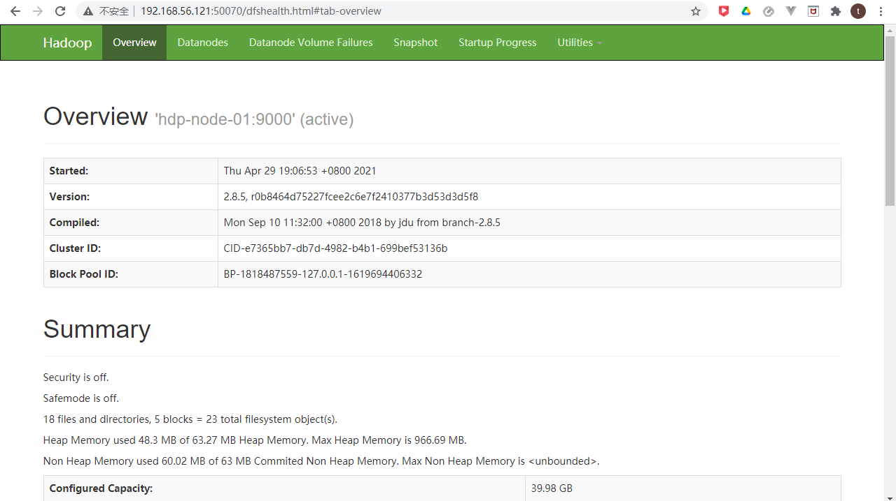
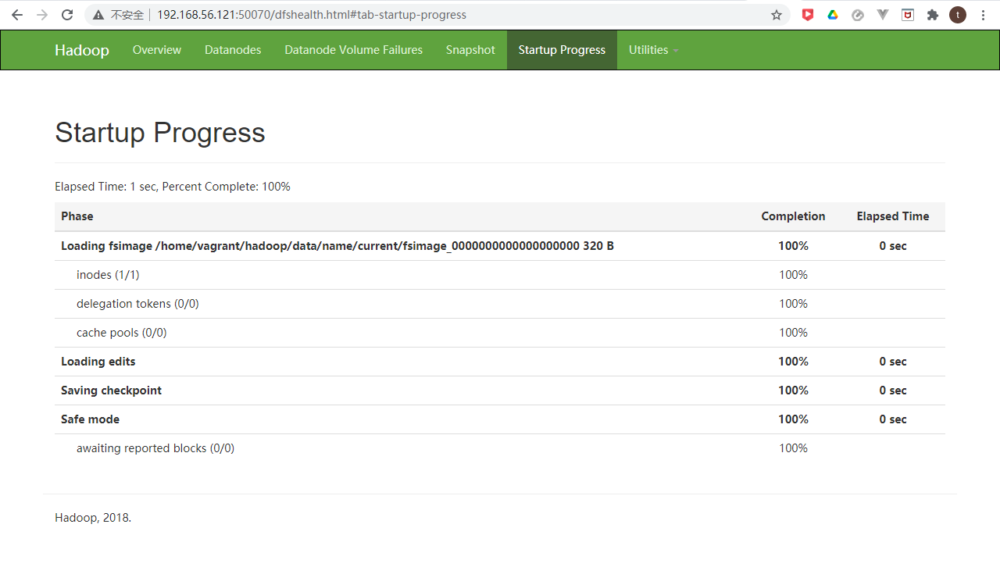

# Setup hadoop cluster using vagrant

* Virtualbox 6.0
* vagrant 2.2.5
* jdk ： jdk-11.0.11_linux-x64_bin.tar.gz
* hadoop：hadoop-2.8.5.tar.gz


```cmd
D:\HashiCorp\ws-vagrant\hadoop-cluster>tree /F
卷 新加卷 的文件夹 PATH 列表
卷序列号为 02DA-4723
D:.
│  build_cluster.pdf
│  hadoop-2.8.5.tar.gz
│  jdk-11.0.11_linux-x64_bin.tar.gz
│  README.md
│  sshd_config
│  Vagrantfile
├─env
│      core-site.xml
│      hadoop-env.sh
│      hdfs-site.xml
│      mapred-site.xml
│      slaves
│      yarn-env.sh
│      yarn-site.xml
│
└─test
        somewords.txt
        start.sh

```


## 1. Prepare environment

* install Virtualbox and vagrant 


## 2. Prepare Vagrantfile

```bash
# -*- mode: ruby -*-
# vi: set ft=ruby :

#
#this is for building master
#
#author:lhy
#time:2018.8.25
#
$clusters_script = <<-SCRIPT
#!/bin/bash

# at /home/vagrant
#---hosts---
cat >> /etc/hosts <<EOF

192.168.56.121  hdp-node-01
192.168.56.122  hdp-node-02
192.168.56.123  hdp-node-03

EOF
#---env---
cat >> /root/.bashrc <<EOF
export HADOOP_HOME=/home/vagrant/hadoop
export JAVA_HOME=/home/vagrant/jdk
export PATH=$PATH:home/vagrant/hadoop/bin/
EOF
source /root/.bashrc

cat >> .bashrc <<EOF
export HADOOP_HOME=/home/vagrant/hadoop
export JAVA_HOME=/home/vagrant/jdk
export PATH=$PATH:home/vagrant/hadoop/bin/
EOF
source .bashrc


#---hadoop---
tar -zxf hadoop-2.8.5.tar.gz
mv hadoop-2.8.5 hadoop
mv env/*  hadoop/etc/hadoop/
rm  hadoop-2.8.5.tar.gz

#---jdk---
tar -zxf jdk-11.0.11_linux-x64_bin.tar.gz
mv jdk-11.0.11 jdk
rm jdk-11.0.11_linux-x64_bin.tar.gz


#---ssh---
mv /home/vagrant/sshd_config /etc/ssh/sshd_config
systemctl restart sshd.service

SCRIPT


Vagrant.configure("2") do |config|

		(1..3).each do |i|
		config.vm.define "hdp#{i}" do |node|
	
		# 设置虚拟机的Box
		node.vm.box = "centos/7"
		# 设置虚拟机的主机名
		node.vm.hostname="hdp-node-0#{i}"
		# 设置虚拟机的IP
		node.vm.network "private_network", ip: "192.168.56.#{120+i}"

		# 设置主机与虚拟机的共享目录
		#node.vm.synced_folder "~/Desktop/share", "/home/vagrant/share"
		# 复制相应的依赖文件
		config.vm.provision "file", source: "./jdk-11.0.11_linux-x64_bin.tar.gz", destination: "/home/vagrant/jdk-11.0.11_linux-x64_bin.tar.gz"
		config.vm.provision "file", source: "./hadoop-2.8.5.tar.gz", destination: "/home/vagrant/hadoop-2.8.5.tar.gz"
		config.vm.provision "file", source: "./sshd_config", destination: "/home/vagrant/sshd_config"
		config.vm.provision "file", source: "./env", destination: "/home/vagrant/env"
		config.vm.provision "file", source: "./test", destination: "/home/vagrant/test"

		# VirtaulBox相关配置
		node.vm.provider "virtualbox" do |v|
			# 设置虚拟机的名称
			v.name = "hdp#{i}"
			# 设置虚拟机的内存大小  
			v.memory = 1024
			# 设置虚拟机的CPU个数
			v.cpus = 1
		end
		node.vm.provision "shell", inline: $clusters_script # 使用shell脚本进行软件安装和配置
		end
	end
end

```


* 脚本部分

```bash
#!/bin/bash

# at /home/vagrant
#---hosts---
cat >> /etc/hosts <<EOF

192.168.56.121  hdp-node-01
192.168.56.122  hdp-node-02
192.168.56.123  hdp-node-03

EOF
#---env---
cat >> /root/.bashrc <<EOF
export HADOOP_HOME=/home/vagrant/hadoop
export JAVA_HOME=/home/vagrant/jdk
export PATH=$PATH:home/vagrant/hadoop/bin/
EOF
source /root/.bashrc

cat >> .bashrc <<EOF
export HADOOP_HOME=/home/vagrant/hadoop
export JAVA_HOME=/home/vagrant/jdk
export PATH=$PATH:home/vagrant/hadoop/bin/
EOF
source .bashrc


#---hadoop---
tar -zxf hadoop-2.8.5.tar.gz
mv hadoop-2.8.5 hadoop
mv env/*  hadoop/etc/hadoop/
rm  hadoop-2.8.5.tar.gz

#---jdk---
tar -zxf jdk-11.0.11_linux-x64_bin.tar.gz
mv jdk-11.0.11 jdk
rm jdk-11.0.11_linux-x64_bin.tar.gz


#---ssh---
mv /home/vagrant/sshd_config /etc/ssh/sshd_config
systemctl restart sshd.service
```

这部分嵌在了Vagrantfile中。


* 虚拟机部分

| hdp-node-01    | hdp-node-02    | hdp-node-03    |
| -------------- | -------------- | -------------- |
| 192.168.56.121 | 192.168.56.122 | 192.168.56.123 |


* 配置文件部分
  * core-site.xml
  * hadoop-env.sh
  * hdfs-site.xml
  * mapred-site.xml
  * slaves
  * yarn-env.sh
  * yarn-site.xml

从env复制到虚拟机中`home/vagrant/env`


## 3. Run `vagrant up`

```cmd
[D:\HashiCorp\ws-vagrant\hadoop-cluster]$ vagrant up
Bringing machine 'hdp1' up with 'virtualbox' provider...
Bringing machine 'hdp2' up with 'virtualbox' provider...
Bringing machine 'hdp3' up with 'virtualbox' provider...
==> hdp1: Importing base box 'centos/7'...
==> hdp1: Matching MAC address for NAT networking...
==> hdp1: Checking if box 'centos/7' version '2004.01' is up to date...
==> hdp1: Setting the name of the VM: hdp1
==> hdp1: Fixed port collision for 22 => 2222. Now on port 2202.
==> hdp1: Clearing any previously set network interfaces...
==> hdp1: Preparing network interfaces based on configuration...
    hdp1: Adapter 1: nat
    hdp1: Adapter 2: hostonly
==> hdp1: Forwarding ports...
    hdp1: 22 (guest) => 2202 (host) (adapter 1)
==> hdp1: Running 'pre-boot' VM customizations...
==> hdp1: Booting VM...
==> hdp1: Waiting for machine to boot. This may take a few minutes...
    hdp1: SSH address: 127.0.0.1:2202
    hdp1: SSH username: vagrant
    hdp1: SSH auth method: private key
    hdp1: 
    hdp1: Vagrant insecure key detected. Vagrant will automatically replace
    hdp1: this with a newly generated keypair for better security.
    hdp1: 
    hdp1: Inserting generated public key within guest...
    hdp1: Removing insecure key from the guest if it's present...
    hdp1: Key inserted! Disconnecting and reconnecting using new SSH key...
==> hdp1: Machine booted and ready!
==> hdp1: Checking for guest additions in VM...
    hdp1: No guest additions were detected on the base box for this VM! Guest
    hdp1: additions are required for forwarded ports, shared folders, host only
    hdp1: networking, and more. If SSH fails on this machine, please install
    hdp1: the guest additions and repackage the box to continue.
    hdp1: 
    hdp1: This is not an error message; everything may continue to work properly,
    hdp1: in which case you may ignore this message.
==> hdp1: Setting hostname...
==> hdp1: Configuring and enabling network interfaces...
==> hdp1: Rsyncing folder: /cygdrive/d/HashiCorp/ws-vagrant/hadoop-cluster/ => /vagrant
==> hdp1: Running provisioner: file...
    hdp1: D:/HashiCorp/ws-vagrant/hadoop-cluster/jdk-11.0.11_linux-x64_bin.tar.gz => /home/vagrant/jdk-11.0.11_linux-x64_bin.tar.gz
==> hdp1: Running provisioner: file...
    hdp1: D:/HashiCorp/ws-vagrant/hadoop-cluster/hadoop-2.8.5.tar.gz => /home/vagrant/hadoop-2.8.5.tar.gz
==> hdp1: Running provisioner: file...
    hdp1: D:/HashiCorp/ws-vagrant/hadoop-cluster/sshd_config => /home/vagrant/sshd_config
==> hdp1: Running provisioner: file...
    hdp1: D:/HashiCorp/ws-vagrant/hadoop-cluster/env/. => /home/vagrant/env
==> hdp1: Running provisioner: file...
    hdp1: D:/HashiCorp/ws-vagrant/hadoop-cluster/test/. => /home/vagrant/test
==> hdp1: Running provisioner: shell...
    hdp1: Running: inline script
==> hdp2: Importing base box 'centos/7'...
==> hdp2: Matching MAC address for NAT networking...
==> hdp2: Checking if box 'centos/7' version '2004.01' is up to date...
==> hdp2: Setting the name of the VM: hdp2
==> hdp2: Fixed port collision for 22 => 2222. Now on port 2203.
==> hdp2: Clearing any previously set network interfaces...
==> hdp2: Preparing network interfaces based on configuration...
    hdp2: Adapter 1: nat
    hdp2: Adapter 2: hostonly
==> hdp2: Forwarding ports...
    hdp2: 22 (guest) => 2203 (host) (adapter 1)
==> hdp2: Running 'pre-boot' VM customizations...
==> hdp2: Booting VM...
==> hdp2: Waiting for machine to boot. This may take a few minutes...
    hdp2: SSH address: 127.0.0.1:2203
    hdp2: SSH username: vagrant
    hdp2: SSH auth method: private key
    hdp2: 
    hdp2: Vagrant insecure key detected. Vagrant will automatically replace
    hdp2: this with a newly generated keypair for better security.
    hdp2: 
    hdp2: Inserting generated public key within guest...
    hdp2: Removing insecure key from the guest if it's present...
    hdp2: Key inserted! Disconnecting and reconnecting using new SSH key...
==> hdp2: Machine booted and ready!
==> hdp2: Checking for guest additions in VM...
    hdp2: No guest additions were detected on the base box for this VM! Guest
    hdp2: additions are required for forwarded ports, shared folders, host only
    hdp2: networking, and more. If SSH fails on this machine, please install
    hdp2: the guest additions and repackage the box to continue.
    hdp2: 
    hdp2: This is not an error message; everything may continue to work properly,
    hdp2: in which case you may ignore this message.
==> hdp2: Setting hostname...
==> hdp2: Configuring and enabling network interfaces...
==> hdp2: Rsyncing folder: /cygdrive/d/HashiCorp/ws-vagrant/hadoop-cluster/ => /vagrant
==> hdp2: Running provisioner: file...
    hdp2: D:/HashiCorp/ws-vagrant/hadoop-cluster/jdk-11.0.11_linux-x64_bin.tar.gz => /home/vagrant/jdk-11.0.11_linux-x64_bin.tar.gz
==> hdp2: Running provisioner: file...
    hdp2: D:/HashiCorp/ws-vagrant/hadoop-cluster/hadoop-2.8.5.tar.gz => /home/vagrant/hadoop-2.8.5.tar.gz
==> hdp2: Running provisioner: file...
    hdp2: D:/HashiCorp/ws-vagrant/hadoop-cluster/sshd_config => /home/vagrant/sshd_config
==> hdp2: Running provisioner: file...
    hdp2: D:/HashiCorp/ws-vagrant/hadoop-cluster/env/. => /home/vagrant/env
==> hdp2: Running provisioner: file...
    hdp2: D:/HashiCorp/ws-vagrant/hadoop-cluster/test/. => /home/vagrant/test
==> hdp2: Running provisioner: file...
    hdp2: D:/HashiCorp/ws-vagrant/hadoop-cluster/jdk-11.0.11_linux-x64_bin.tar.gz => /home/vagrant/jdk-11.0.11_linux-x64_bin.tar.gz
==> hdp2: Running provisioner: file...
    hdp2: D:/HashiCorp/ws-vagrant/hadoop-cluster/hadoop-2.8.5.tar.gz => /home/vagrant/hadoop-2.8.5.tar.gz
==> hdp2: Running provisioner: file...
    hdp2: D:/HashiCorp/ws-vagrant/hadoop-cluster/sshd_config => /home/vagrant/sshd_config
==> hdp2: Running provisioner: file...
    hdp2: D:/HashiCorp/ws-vagrant/hadoop-cluster/env/. => /home/vagrant/env
==> hdp2: Running provisioner: file...
    hdp2: D:/HashiCorp/ws-vagrant/hadoop-cluster/test/. => /home/vagrant/test
==> hdp2: Running provisioner: shell...
    hdp2: Running: inline script
==> hdp3: Importing base box 'centos/7'...
==> hdp3: Matching MAC address for NAT networking...
==> hdp3: Checking if box 'centos/7' version '2004.01' is up to date...
==> hdp3: Setting the name of the VM: hdp3
==> hdp3: Fixed port collision for 22 => 2222. Now on port 2204.
==> hdp3: Clearing any previously set network interfaces...
==> hdp3: Preparing network interfaces based on configuration...
    hdp3: Adapter 1: nat
    hdp3: Adapter 2: hostonly
==> hdp3: Forwarding ports...
    hdp3: 22 (guest) => 2204 (host) (adapter 1)
==> hdp3: Running 'pre-boot' VM customizations...
==> hdp3: Booting VM...
==> hdp3: Waiting for machine to boot. This may take a few minutes...
    hdp3: SSH address: 127.0.0.1:2204
    hdp3: SSH username: vagrant
    hdp3: SSH auth method: private key
    hdp3: 
    hdp3: Vagrant insecure key detected. Vagrant will automatically replace
    hdp3: this with a newly generated keypair for better security.
    hdp3: 
    hdp3: Inserting generated public key within guest...
    hdp3: Removing insecure key from the guest if it's present...
    hdp3: Key inserted! Disconnecting and reconnecting using new SSH key...
==> hdp3: Machine booted and ready!
==> hdp3: Checking for guest additions in VM...
    hdp3: No guest additions were detected on the base box for this VM! Guest
    hdp3: additions are required for forwarded ports, shared folders, host only
    hdp3: networking, and more. If SSH fails on this machine, please install
    hdp3: the guest additions and repackage the box to continue.
    hdp3: 
    hdp3: This is not an error message; everything may continue to work properly,
    hdp3: in which case you may ignore this message.
==> hdp3: Setting hostname...
==> hdp3: Configuring and enabling network interfaces...
==> hdp3: Rsyncing folder: /cygdrive/d/HashiCorp/ws-vagrant/hadoop-cluster/ => /vagrant
==> hdp3: Running provisioner: file...
    hdp3: D:/HashiCorp/ws-vagrant/hadoop-cluster/jdk-11.0.11_linux-x64_bin.tar.gz => /home/vagrant/jdk-11.0.11_linux-x64_bin.tar.gz
==> hdp3: Running provisioner: file...
    hdp3: D:/HashiCorp/ws-vagrant/hadoop-cluster/hadoop-2.8.5.tar.gz => /home/vagrant/hadoop-2.8.5.tar.gz
==> hdp3: Running provisioner: file...
    hdp3: D:/HashiCorp/ws-vagrant/hadoop-cluster/sshd_config => /home/vagrant/sshd_config
==> hdp3: Running provisioner: file...
    hdp3: D:/HashiCorp/ws-vagrant/hadoop-cluster/env/. => /home/vagrant/env
==> hdp3: Running provisioner: file...
    hdp3: D:/HashiCorp/ws-vagrant/hadoop-cluster/test/. => /home/vagrant/test
==> hdp3: Running provisioner: file...
    hdp3: D:/HashiCorp/ws-vagrant/hadoop-cluster/jdk-11.0.11_linux-x64_bin.tar.gz => /home/vagrant/jdk-11.0.11_linux-x64_bin.tar.gz
==> hdp3: Running provisioner: file...
    hdp3: D:/HashiCorp/ws-vagrant/hadoop-cluster/hadoop-2.8.5.tar.gz => /home/vagrant/hadoop-2.8.5.tar.gz
==> hdp3: Running provisioner: file...
    hdp3: D:/HashiCorp/ws-vagrant/hadoop-cluster/sshd_config => /home/vagrant/sshd_config
==> hdp3: Running provisioner: file...
    hdp3: D:/HashiCorp/ws-vagrant/hadoop-cluster/env/. => /home/vagrant/env
==> hdp3: Running provisioner: file...
    hdp3: D:/HashiCorp/ws-vagrant/hadoop-cluster/test/. => /home/vagrant/test
==> hdp3: Running provisioner: file...
    hdp3: D:/HashiCorp/ws-vagrant/hadoop-cluster/jdk-11.0.11_linux-x64_bin.tar.gz => /home/vagrant/jdk-11.0.11_linux-x64_bin.tar.gz
==> hdp3: Running provisioner: file...
    hdp3: D:/HashiCorp/ws-vagrant/hadoop-cluster/hadoop-2.8.5.tar.gz => /home/vagrant/hadoop-2.8.5.tar.gz
==> hdp3: Running provisioner: file...
    hdp3: D:/HashiCorp/ws-vagrant/hadoop-cluster/sshd_config => /home/vagrant/sshd_config
==> hdp3: Running provisioner: file...
    hdp3: D:/HashiCorp/ws-vagrant/hadoop-cluster/env/. => /home/vagrant/env
==> hdp3: Running provisioner: file...
    hdp3: D:/HashiCorp/ws-vagrant/hadoop-cluster/test/. => /home/vagrant/test
==> hdp3: Running provisioner: shell...
    hdp3: Running: inline script

```


## 4. Run hadoop test demo

```bash
[vagrant@hdp-node-01 ~]$ sh test/start.sh 
-------------------
ssh key gen
-------------------
Generating public/private rsa key pair.
Enter file in which to save the key (/root/.ssh/id_rsa): 
Created directory '/root/.ssh'.
Enter passphrase (empty for no passphrase): 
Enter same passphrase again: 
Your identification has been saved in /root/.ssh/id_rsa.
Your public key has been saved in /root/.ssh/id_rsa.pub.
The key fingerprint is:
SHA256:h4tYRNuyQEZmWy2kpiccE/VxTFNl8k/BGDSzUdzTMkA root@hdp-node-01
The key's randomart image is:
+---[RSA 2048]----+
|  .oB.=++.o+EBo..|
|   * *.=o. +.==oo|
|  o = =..   o .o.|
| . = o o .   o   |
|  + . o S .   .  |
|   o o . o       |
|    . . .        |
|                 |
|                 |
+----[SHA256]-----+
/bin/ssh-copy-id: INFO: Source of key(s) to be installed: "/root/.ssh/id_rsa.pub"
The authenticity of host 'hdp-node-01 (127.0.0.1)' can't be established.
ECDSA key fingerprint is SHA256:PNNSglbx5G/ZKSAscBP4cZJOzrZ9fp+xRstO2xWEEj8.
ECDSA key fingerprint is MD5:84:6f:6e:9b:7a:b8:b8:a1:57:36:be:45:3f:d5:e3:79.
Are you sure you want to continue connecting (yes/no)? yes
......

-------------------
hadoop start
-------------------
DEPRECATED: Use of this script to execute hdfs command is deprecated.
Instead use the hdfs command for it.

......

21/04/29 11:09:50 INFO mapreduce.Job: Job job_1619694447173_0001 completed successfully
21/04/29 11:09:50 INFO mapreduce.Job: Counters: 49
	File System Counters
		FILE: Number of bytes read=186
		FILE: Number of bytes written=316073
		FILE: Number of read operations=0
		FILE: Number of large read operations=0
		FILE: Number of write operations=0
		HDFS: Number of bytes read=178
		HDFS: Number of bytes written=100
		HDFS: Number of read operations=6
		HDFS: Number of large read operations=0
		HDFS: Number of write operations=2
	Job Counters 
		Launched map tasks=1
		Launched reduce tasks=1
		Data-local map tasks=1
		Total time spent by all maps in occupied slots (ms)=17637
		Total time spent by all reduces in occupied slots (ms)=7693
		Total time spent by all map tasks (ms)=17637
		Total time spent by all reduce tasks (ms)=7693
		Total vcore-milliseconds taken by all map tasks=17637
		Total vcore-milliseconds taken by all reduce tasks=7693
		Total megabyte-milliseconds taken by all map tasks=18060288
		Total megabyte-milliseconds taken by all reduce tasks=7877632
	Map-Reduce Framework
		Map input records=10
		Map output records=20
		Map output bytes=140
		Map output materialized bytes=186
		Input split bytes=118
		Combine input records=20
		Combine output records=20
		Reduce input groups=20
		Reduce shuffle bytes=186
		Reduce input records=20
		Reduce output records=20
		Spilled Records=40
		Shuffled Maps =1
		Failed Shuffles=0
		Merged Map outputs=1
		GC time elapsed (ms)=148
		CPU time spent (ms)=2100
		Physical memory (bytes) snapshot=335196160
		Virtual memory (bytes) snapshot=4047970304
		Total committed heap usage (bytes)=172507136
	Shuffle Errors
		BAD_ID=0
		CONNECTION=0
		IO_ERROR=0
		WRONG_LENGTH=0
		WRONG_MAP=0
		WRONG_REDUCE=0
	File Input Format Counters 
		Bytes Read=60
	File Output Format Counters 
		Bytes Written=100
[vagrant@hdp-node-01 ~]$ 

```


> start.sh脚本

```bash
#!/bin/bash

echo "-------------------"
echo "ssh key gen"
echo "-------------------"

sudo ssh-keygen
sudo ssh-copy-id -i /root/.ssh/id_rsa.pub root@hdp-node-01
sudo ssh-copy-id -i /root/.ssh/id_rsa.pub root@hdp-node-02
sudo ssh-copy-id -i /root/.ssh/id_rsa.pub root@hdp-node-03

echo "-------------------"
echo "hadoop start"
echo "-------------------"

sudo $HADOOP_HOME/bin/hadoop namenode -format

sudo $HADOOP_HOME/sbin/start-dfs.sh
sudo $HADOOP_HOME/sbin/start-yarn.sh


echo "-------------------"
echo "hadoop example wordcount"
echo "-------------------"

sudo $HADOOP_HOME/bin/hadoop fs -mkdir -p /wordcount/input
sudo $HADOOP_HOME/bin/hadoop fs -put /home/vagrant/test/somewords.txt /wordcount/input
sudo $HADOOP_HOME/bin/hadoop fs -ls /wordcount/input

cd $HADOOP_HOME/share/hadoop/mapreduce
sudo $HADOOP_HOME/bin/hadoop jar hadoop-mapreduce-examples-2.8.5.jar wordcount /wordcount/input /wordcount/output
```


- ssh-keygen生成公私钥
- ssh-copy-id 上传公钥到hdp-node-01、02、03上


http://192.168.56.121:50070/dfshealth.html#tab-overview






## Others

### how to push big size file to github

https://blog.csdn.net/wifi74262580/article/details/85060187


```bash
git lfs install
git lfs track "*.gz"
git add "hadoop-2.8.5.tar.gz"
git commit -m "add hadoop"
git push origin master
```


```cmd
D:\ws2021\gentelman\hadoop-cluster-builder>git lfs install
Updated git hooks.
Git LFS initialized.

D:\ws2021\gentelman\hadoop-cluster-builder>git lfs track "*.gz"
Tracking "*.gz"

D:\ws2021\gentelman\hadoop-cluster-builder>git add .gitattributes

D:\ws2021\gentelman\hadoop-cluster-builder>git add "hadoop-2.8.5.tar.gz"

D:\ws2021\gentelman\hadoop-cluster-builder>git commit -m "add hadoop"
[master 4b97148] add hadoop
 2 files changed, 5 insertions(+)
 create mode 100644 .gitattributes
 create mode 100644 hadoop-2.8.5.tar.gz


D:\ws2021\gentelman\hadoop-cluster-builder>git push origin master
Uploading LFS objects: 100% (1/1), 246 MB | 10 MB/s, done.
Enumerating objects: 5, done.
Counting objects: 100% (5/5), done.
Delta compression using up to 8 threads
Compressing objects: 100% (4/4), done.
Writing objects: 100% (4/4), 479 bytes | 479.00 KiB/s, done.
Total 4 (delta 1), reused 0 (delta 0), pack-reused 0
remote: Resolving deltas: 100% (1/1), completed with 1 local object.
To https://github.com/striderw/hadoop-cluster-builder.git
   6959c41..4b97148  master -> master

D:\ws2021\gentelman\hadoop-cluster-builder>git add "jdk-11.0.11_linux-x64_bin.tar.gz"

D:\ws2021\gentelman\hadoop-cluster-builder>git commit -m "add jdk"
[master abc95d6] add jdk
 1 file changed, 3 insertions(+)
 create mode 100644 jdk-11.0.11_linux-x64_bin.tar.gz

D:\ws2021\gentelman\hadoop-cluster-builder>git push origin master
Uploading LFS objects: 100% (1/1), 182 MB | 6.7 MB/s, done.
Enumerating objects: 4, done.
Counting objects: 100% (4/4), done.
Delta compression using up to 8 threads
Compressing objects: 100% (3/3), done.
Writing objects: 100% (3/3), 394 bytes | 394.00 KiB/s, done.
Total 3 (delta 1), reused 0 (delta 0), pack-reused 0
remote: Resolving deltas: 100% (1/1), completed with 1 local object.
To https://github.com/striderw/hadoop-cluster-builder.git
   4b97148..abc95d6  master -> master

D:\ws2021\gentelman\hadoop-cluster-builder>

```


